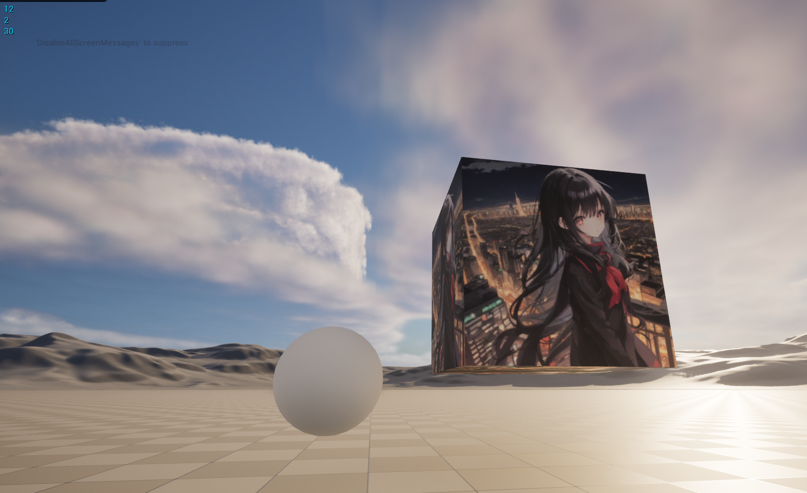

# ComputeShaderDemo
 UE5.3 demos of implementing compute shader via RenderGraph

It currently has three example:

* SimpleComputeShader: execute an async compute shader program and read-back the result into CPU via call-back and delegate
* SimpleComputeShaderParallel: based on the above one, use threadID to make execution parallel per thread in GPU
* SimpleImageEditShader: use Textures to implement image blur effect and visualize the result image on a game object with a material

All of them are implemented with RDG, which is a powerful and convenient tool in low-level UE graphic programming. 

The compute shader related parts are implemented in C++ in CS_Plugin plugin. And the user-interactions are done in blueprints in the demo level. You can read them for reference and learning.
